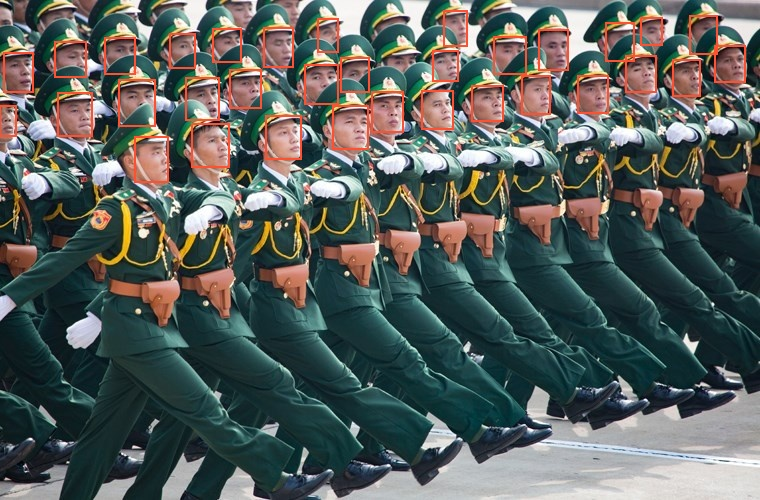

# Face-SSD-MXNet
Face Detector trained by SSD by WIDER dataset
By Danh Doan

## 0. Installation
* Install MXNet framework and GluonCV toolkit
	* For CPU only:
	
		`pip install mxnet gluoncv`
	
	* For GPUs
		
		`pip install mxnet-cu90 gluoncv`
    	> Change to match with CUDA version. `mxnet-cu100` if CUDA 10.0 is installed

## 1. Prepare Dataset
### 1.1 Download WIDER face dataset
* Obtain `train` and `val` datasets from WIDER [[link]](http://shuoyang1213.me/WIDERFACE/)
   Create a symbol link to WIDER directory

   `ln -s /path/to/WIDER`
* Move all image file to JPEGImages folder to easily manipulate

	`mkdir JPEGImages`

### 1.2 Create record data
Follow `lst-rec-prep.ipynb` to create List and RecordIO file - they are the dataset format developed by MXNet. To support the training procedure, it is preferred to utilize data in binary format rather than raw images as well as the annotations.

If you are not familiar with this process, refer this tutorial [[link]](https://gluon-cv.mxnet.io/build/examples_datasets/detection_custom.html)
#### 1.2.1 Create LST file
Follow step 0 to step 2 to first create `.lst` file. By performing these steps, 2 file `train.lst` and `val.lst` are generated.

#### 1.2.2 Create REC file
After obtaining the `.lst` files. Start generating `.rec` by using built-in feature from MXNet

`python /path/to/incubator-mxnet/tools/im2rec.py train.lst WIDER/JPEGImages/ --pass-through --pack-label`

`python /path/to/incubator-mxnet/tools/im2rec.py val.lst WIDER/JPEGImages/ --pass-through --pack-label`

It's gonna take a few seconds to create record files for `train` and `val` datasets. After finishing this step, 4 files are created:
* train.idx
* train.rec
* val.idx
* val.rec

Move all generated files to `datasets` directory

`mkdir datasets`

`mv *.lst *.idx *.rec datasets`

## 2. Train SSD-Face
After the preparation process is successfully done. The training procedure can be started by the following command:

`python3 train_ssd.py`

This is the full training program originally from MXNet [[link]](https://gluon-cv.mxnet.io/build/examples_detection/train_ssd_voc.html).

In this program, face detector is trained by fine-tuning technique and the object detection pretrained model is trained from VOC dataset.

`import gluoncv as gcv`

`TARGET_CLASSES = ['person']`

`net = gcv.model_zoo.get_model('ssd_300_vgg16_atrous_custom', 
                                  classes=TARGET_CLASSES,
                                  pretrained_base=False,
                                  transfer='voc')`

Checkpoints are saved every 10 epochs and the best model with the best accuracy in `val` set is also stored and updated after every single epoch.

## 3. Results:
After processing the training procedure, 3 files are obtained:
* ssd_300_vgg16_atrous_voc_best_map.log
* ssd_300_vgg16_atrous_voc_best.params
* ssd_300_vgg16_atrous_voc_train.log

`test-face-detector.ipynb`is the notebook developed to test the performance of trained Face detection model

Results from my work:

Test with video:
`python3 test-ssdface-vid.py -v /path/to/video -s -r -n video_name`

Check the argument parser in `altusi/helper/funcs.py` to make use of the arguments
